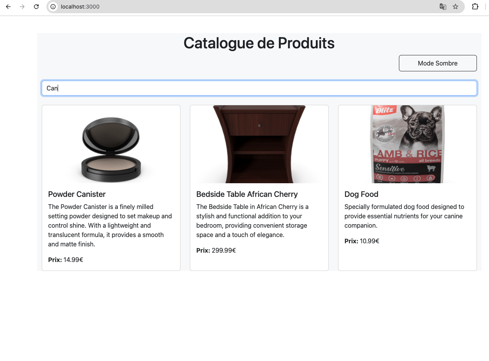
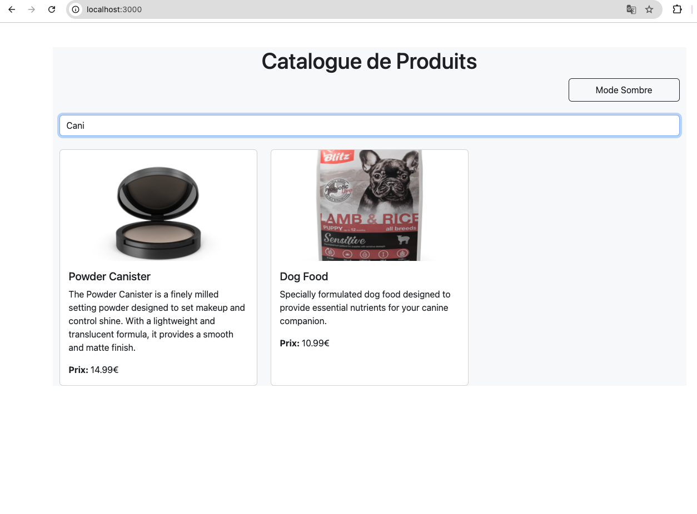
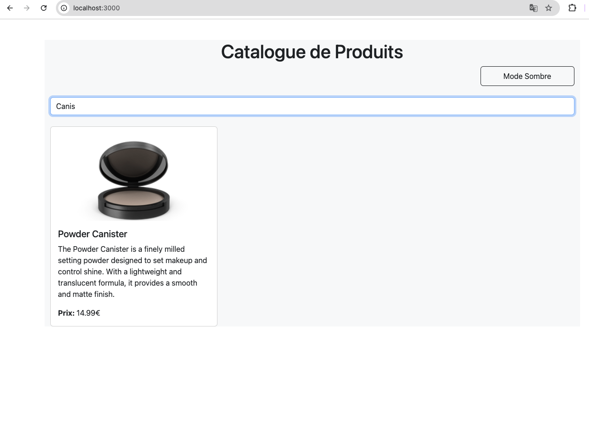
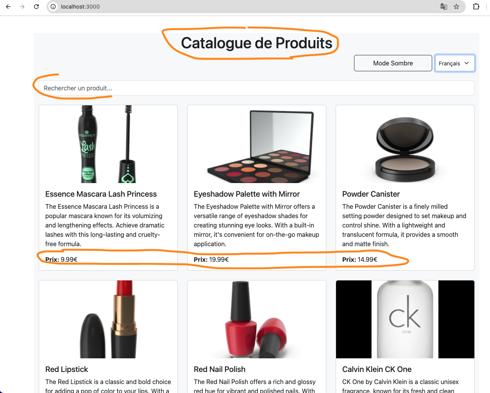
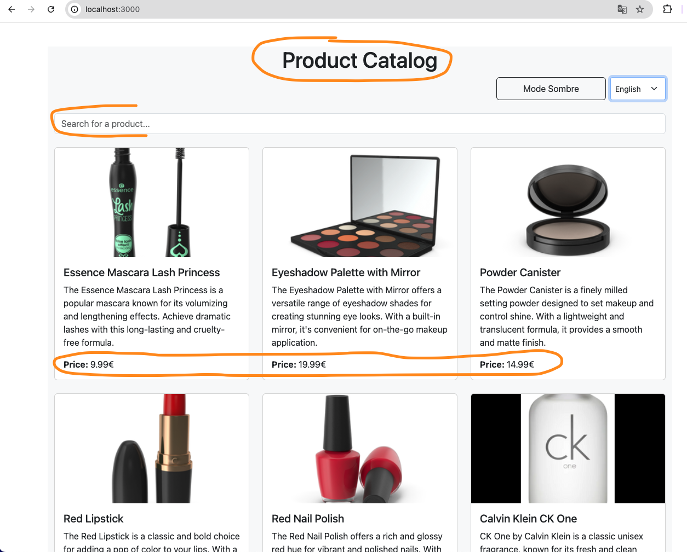
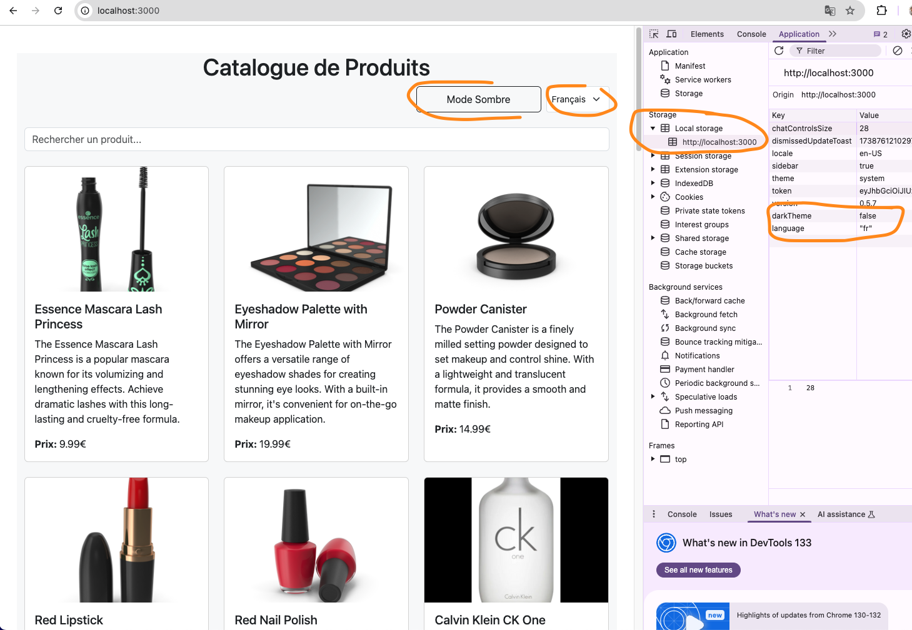

# TP React Hooks - Application de Gestion de Produits

Ce TP a pour objectif de mettre en pratique l'utilisation des Hooks React (useState, useEffect, useContext) ainsi que la création de Hooks personnalisés.

## Installation et configuration initiale

1. Cloner le dépôt :
```bash
git clone https://github.com/pr-daaif/tp-react-hooks.git
cd tp-react-hooks
```

2. Créer votre propre dépôt sur Github et changer le remote :
```bash
# Supprimer le remote origine
git remote remove origin

# Ajouter votre nouveau remote
git remote add origin https://github.com/[votre-username]/tp-react-hooks.git

# Premier push
git push -u origin main
```

3. Installer les dépendances :
```bash
npm install
```

4. Lancer l'application :
```bash
npm start
```

## Instructions pour le TP

Pour chaque exercice :
1. Lisez attentivement l'énoncé
2. Implémentez la solution
3. Testez votre implémentation (pensez à faire des copies d'écran)
4. Mettez à jour la section correspondante dans ce README avec :
   - Une brève explication de votre solution
   - Des captures d'écran montrant le fonctionnement
   - Les difficultés rencontrées et comment vous les avez résolues
5. Commitez vos changements avec un message descriptif

### Exercice 1 : État et Effets 
#### Objectif : Implémenter une recherche en temps réel

- [ ] 1.1 Modifier le composant ProductSearch pour utiliser la recherche
- [ ] 1.2 Implémenter le debounce sur la recherche
- [ ] 1.3 Documenter votre solution ici

_Votre réponse pour l'exercice 1 :_
```
Expliquez votre solution ici:
Documentation de la solution
1-Ajouté un système de recherche qui filtre les produits en fonction du terme saisi
2- Implémenté un hook personnalisé useDebounce pour éviter de déclencher trop de recherches pendant la saisie
3- Connecté le composant ProductSearch au reste de l'application via les props et useEffect
4- Ajouté une fonction pour filtrer les produits dans le hook useProductSearch

Le debounce permet d'améliorer les performances en attendant que l'utilisateur finisse de taper avant de lancer la recherche.

[Ajoutez vos captures d'écran]
```


### Exercice 2 : Context et Internationalisation
#### Objectif : Gérer les préférences de langue

- [ ] 2.1 Créer le LanguageContext
- [ ] 2.2 Ajouter le sélecteur de langue
- [ ] 2.3 Documenter votre solution ici

_Votre réponse pour l'exercice 2 :_
```
Documentation de la solution
1- J'ai créé un LanguageContext qui contient:
   - La langue actuelle
   - La fonction pour changer de langue
   - Un helper de traduction t()
   - Un objet de traductions pour français et anglais

2- Ajouté un sélecteur de langue permettant de basculer entre français et anglais
3- Implémenté les traductions dans les composants à l'aide du hook useContext
4- Traduit les éléments textuels comme les titres, les messages d'erreur, et les placeholders

Cette solution permet une gestion centralisée des traductions et facilite l'ajout de nouvelles langues dans le futur.

[Ajoutez vos captures d'écran]
```


### Exercice 3 : Hooks Personnalisés
#### Objectif : Créer des hooks réutilisables

- [ ] 3.1 Créer le hook useDebounce
- [ ] 3.2 Créer le hook useLocalStorage
- [ ] 3.3 Documenter votre solution ici

_Votre réponse pour l'exercice 3 :_
```
Documentation de la solution:
1- Implémenté le hook useDebounce(nous l'avions deja fais a l'excercice 1) qui permet de retarder l'exécution d'une action (ici la recherche) jusqu'à ce que l'utilisateur ait fini de taper
2- Créé le hook useLocalStorage qui:
   - Persiste les valeurs dans localStorage
   - Fournit une API similaire à useState
   - Gère la synchronisation entre les onglets/fenêtres
   - Gère les erreurs de sérialisation/désérialisation

3- Utilisé useLocalStorage pour persister les préférences utilisateur (thème et langue)

Ces hooks personnalisés améliorent l'expérience utilisateur en:
   - Réduisant les requêtes inutiles avec useDebounce
   - Conservant les préférences entre les sessions avec useLocalStorage

[Ajoutez vos captures d'écran]
```


### Exercice 4 : Gestion Asynchrone et Pagination
#### Objectif : Gérer le chargement et la pagination

- [ ] 4.1 Ajouter le bouton de rechargement
- [ ] 4.2 Implémenter la pagination
- [ ] 4.3 Documenter votre solution ici

_Votre réponse pour l'exercice 4 :_
```
Expliquez votre solution ici
[Ajoutez vos captures d'écran]
```

## Rendu

- Ajoutez l'URL de votre dépôt Github dans  **Classroom** et envoyer la réponse dès le démarage de votre projet.
- Les push doivent se faire au fûr et à mesure que vous avancez dans votre projet.
- Le README.md doit être à jour avec vos réponses et captures d'écran. 
- Chaques exercice doit faire l'objet d'au moins un commit avec un message mentionnant le numéro de l'exercice.